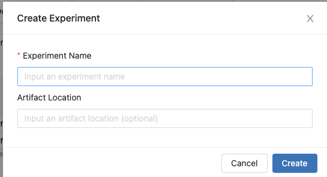
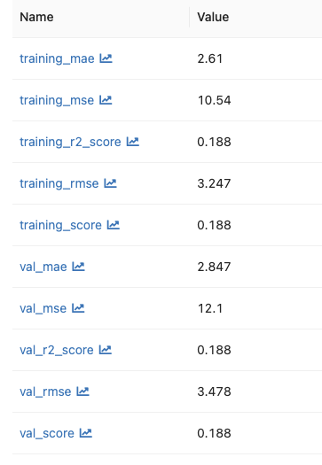
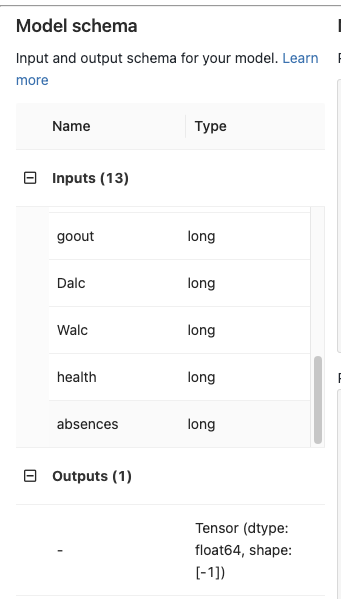
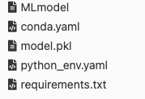
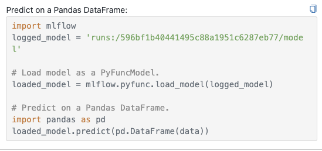
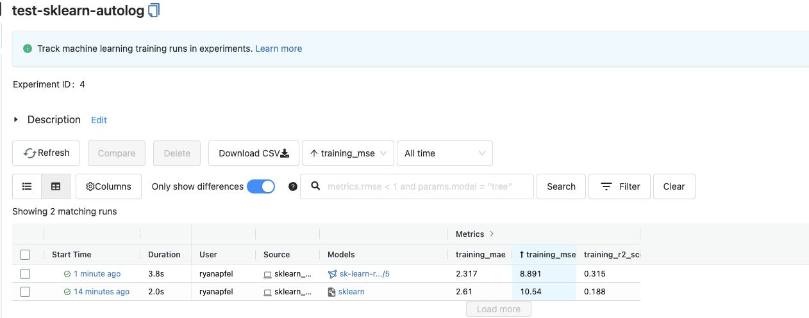

# MLFlow Documentation

# Steps:

1. Create an Experiment in the mlflow portal
    
    
    
    For this experiment we will name it:
    
    ```markdown
    Experiment Name: test-sklearn-autolog
    Artifact Location: s3://mlflow-volkno/test-sklearn
    ```
    
2. Change to mlflowtest repo. Make sure you are using PIP as your package manager and that mlflow is installed. 
    
    ```bash
    pip3 install mlflow
    cd mlflowtest
    ```
    
3. Run lower quality model to see poor performance

```bash
python3 sklearn_autolog.py lower_quality
```

If we now check Mlflow, the following information is stored









1. Run on higher quality model. This model uses one-hot encoding on categorical variables instead of dropping them. this should result in a better fit.

```bash
python3 sklearn_autolog.py higherquality
```

Mlflow shows the following data in the experiment tab. As seen below, training mse and val_mse are lower on the “higher quality” model. 

